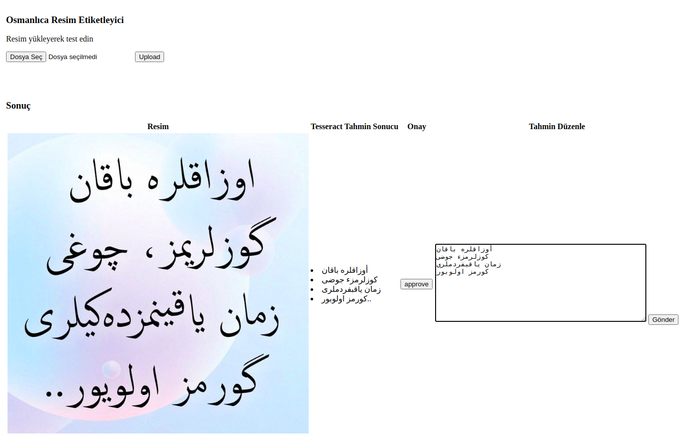

# tesseract-flask-image-labeling tool
A simple tagging application. Ottoman pictures estimated with tesseract in the background are labeled as true or false by the user. Data is collected for model training with correct labeling.

## Getting Started
These instructions will get you a copy of the project up and running on your local machine for development and testing purposes.
1. Clone this repository with Git Large File Storage(LFS) `git lfs clone https://github.com/mitkir/tesseract-flask-image-labeling`
2. Open project's directory `cd tesseract-flask-image-labeling`
3. Install all necessary dependencies `pip install -r requirements.txt`
4. Run application `python application.py`
5. Open `http://127.0.0.1:5000/` on your browser
6. Click the file select button and select test image for tagging.

### Prerequisites
The application requres some external libraries to run (flask , tesseract).
All dependencies you can find at requirement.txt and install it.

### Tesseract Model
The tesseract model version used in forecasting is 4. More information can be found at `https://github.com/tesseract-ocr/tesseract`.

### DEMO

